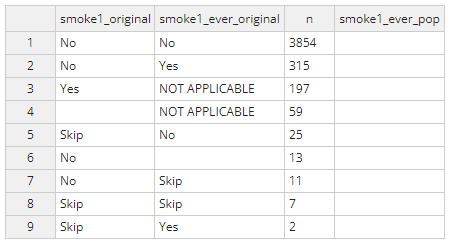
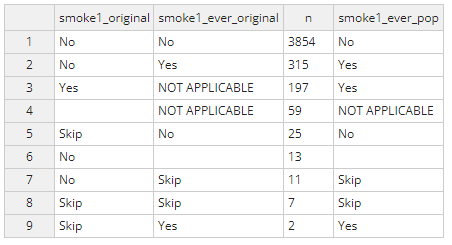
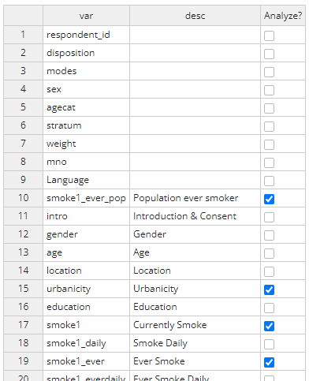
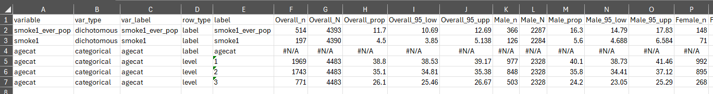
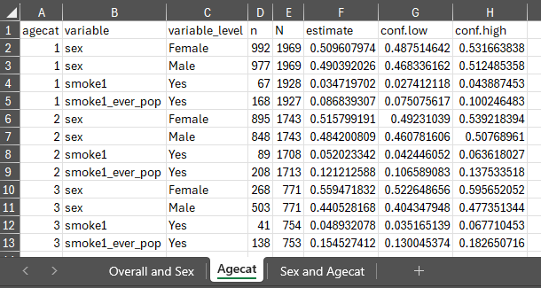
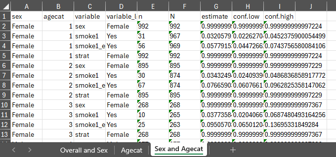

```{r, include = FALSE}
knitr::opts_chunk$set(
  collapse = TRUE,
  comment = "#>"
)
```

```{r setup}
knitr::opts_chunk$set(
	message = FALSE,
	warning = FALSE
)
library(MPSurvey)
```

# Walkthrough Overview

This walkthrough guides you through the analysis process for the 2022 noncommunicable disease mobile phone survey conducted in Rwanda. The data for the analysis and the questionnaire metadata can be accessed at the following links and saved on your computer:

-   [Survey data](https://drive.google.com/file/d/1wkPiUvF5LtVxuC3boZbMBBHJP5wBnuZz/view?usp=sharing "Weighted Rwanda NCD survey data")

-   [Questionnaire JSON file](https://drive.google.com/file/d/145A-UgVT7Cc9RrJQuDmsmCdAcisWcFgw/view?usp=sharing "Questionnaire and logic file in JSON format")

The analysis follows the general structure outlined below:

1.  Loading survey data and questionnaire metadata

2.  Labeling and describing data, applying skip logic, and recoding indicators

3.  Analyzing survey data

4.  Exporting results and other outputs

# Loading survey data and questionnaire metadata

The survey data can be loaded with `read.csv("ug_publicuse_5421.csv")`. Loading the questionnaire metadata relies on the following three functions: `get_codebook()`, `get_descriptions()`, and `get_skiplogic()`. The R code below shows these steps and their output:

## Loading data

```{r load_data, echo=FALSE}
rw_publicuse_4483 <- read.csv("C:/Users/qno4/Downloads/rw_publicuse_4483.csv")
```

```{r, eval=FALSE}
rw_publicuse_4483 <- read.csv("rw_publicuse_4483.csv")
```

```{r load_data_output, echo=FALSE}
DT::datatable((rw_publicuse_4483), options = list(scrollX = TRUE))
```

## Importing codebook

The codebook contains each variable (`grp`) and the potential response labels (`values`) and the responses coded in the data (`options`).

```{r import_codebook, echo=FALSE}
codebook <- get_codebook(path = "C:/Users/qno4/Downloads/manifest.json")
```

```{r import_codebook2, eval=FALSE}
codebook <- get_codebook(path = "manifest.json")
```

```{r codebook_output, echo=FALSE}
DT::datatable(codebook, options = list(scrollX = TRUE))
```

## Importing variable descriptions

The descriptions contains a detailed description (`desc`) for each variable (`var`).

```{r import_desc, echo=FALSE}
descriptions <- get_descriptions(path = "C:/Users/qno4/Downloads/manifest.json")
```

```{r import_desc2, eval=FALSE}
descriptions <- get_descriptions(path = "manifest.json")
```

```{r desc_output, echo=FALSE}
DT::datatable(descriptions, options = list(scrollX = TRUE))
```

## Importing skip logic

A data frame containing the skip logic information, including variables, question IDs, question text, response values, and skip logic conditions.

```{r import_skip_real, echo=FALSE}
skip <- get_skiplogic(path = "C:/Users/qno4/Downloads/manifest.json")
```

```{r import_skip, eval=FALSE}
skip <- get_skiplogic(path = "manifest.json")
```

```{r skip_output, echo=FALSE}
DT::datatable(skip, options = list(scrollX = TRUE))
```

These inputs are used in data manipulation, analysis, and exporting functions and the above functions are frequently referenced within processing steps.

# Labeling and describing data, applying skip logic, and recoding indicators

## Label data

The first step in the data manipulation process is to apply data labels to the survey data using the output from `get_codebook()`.

```{r label_data}
rw_label <- label_data(rw_publicuse_4483, codebook = codebook)
```

```{r label_data_output}
DT::datatable(rw_label, options = list(pageLength=5, scrollX = TRUE))
```

## Applying skip logic

Following the labeling of data, skip logic from the questionnaire is applied to the survey results to determine when missing values are truly `NA` or if they should be recoded as `NOT APPLICABLE`. As this function runs, it will output information in the console that highlights the variable that previous responses could potentially skip (`Skip Logic Variable`) and the parent value and responses that would allow that variable to be shown to a respondent (`Parent variable` and `Response values`).

```{r skip_fake, eval=FALSE}
rw_label_skip <- apply_skiplogic(path = "manifest.json", x = rw_label)
```

```{r skip_real, echo=FALSE}
rw_label_skip <- apply_skiplogic(path = "C:/Users/qno4/Downloads/manifest.json", x = rw_label)
```

```{r label_skip_output}
DT::datatable(rw_label_skip,
              options = list(pageLength=5, scrollX = TRUE))
```

## Recoding variables

Once skip logic is applied, we can then move into recoding variables or generating new variables to use in the analysis. One example is with `smoke1` and `smoke1_ever`. `smoke1` asks whether a respondent currently smokes tobacco products and `smoke1_ever` asks respondents if they have ever smoked tobacco products. Due to the built-in skip logic, if a person answered `yes` to `smoke1`, they wouldn't be asked `smoke1_ever` because we know that they currently smoke tobacco products. To get the correct population-level indicator for `smoke1_ever`, we need to account for the `yes`'s from `smoke1`. To do this, we can use the `recode_var()` function.

```{r recode, eval=FALSE}
rw_analysis <- recode_var(rw_label_skip, vars=c("smoke1", "smoke1_ever"),new_var = smoke1_ever_pop) 
```

```{r recode_real, echo=FALSE}
rw_analysis <- rw_label_skip %>%
  mutate(smoke1_ever_pop = case_when(smoke1_ever=="No" ~ "No",
                                     smoke1_ever=="Yes" ~ "Yes",
                                     smoke1=="Yes" ~ "Yes",
                                     smoke1_ever=="NOT APPLICABLE" ~ "NOT APPLICABLE",
                                     is.na(smoke1_ever) ~ NA_character_,
                                     smoke1_ever=="Skip" ~ "Skip",
                                     TRUE ~ "ASDF"))
```

Running this function will generate a popup window like the image below. This is where you can copy over the correct values for the new variable called `alcohol2_pop`.



Applying the logic above, the completed table should look like the table below. Once complete, select 'done' at the top right and the edited dataset will be saved as `rw_analysis`.



The `recode_var()` function can be used for any new variables that need to be created. *REMINDER*: always write the output of this function back to the same analysis dataframe to save the edits.

## Setting final descriptions

The final step is to set the final variable descriptions, especially for any newly developed indicators from the `recode_var()` function. The `set_descriptions()` function will also create a popup window where you can add or edit descriptions.

```{r descriptions, eval=FALSE}
desc <- set_descriptions(path="manifest.json", x=rw_analysis)
```

# Analyzing survey data

## Selecting survey variables for analysis

The first step in this process is to select the variables of interest for the MPS analysis using the `survey_variables()` function. This function will create a popup window like the image below where you can toggle variables for inclusion in the analysis. Only select the indicator variables that will correspond to the population-level estimates and not the variables used for strata/weighting as those are selected in a different step.

```{r selecting_vars, eval=FALSE}
vars <- survey_variables(desc = desc)
```

```{r var_select_real, echo=FALSE}
vars <- c("urbanicity", "smoke1", "smoke1_ever_pop")
```

## 

## Creating survey design object

Once the variables are selected, we will use the `mps_design()` function to generate the survey design object using the `srvyr` package. This function requires the following information:

-   `df`: the analytic dataframe

-   `ids`: the unique identifiers for respondents, usually `respondent_id`

-   `strata`: the strata used for sampling and weighting, typically `agecat` and `sex`

-   `weight`: the variable storing the weighting value

-   `vars`: the list of variables for the analysis

```{r survey_design}
mps <- mps_design(df = rw_analysis, 
                  ids = respondent_id, 
                  strata = c(agecat, sex), 
                  weight = weight, 
                  vars = vars)

```

The `mps` object is now a `tbl_svy` object that can be used for weighted survey analysis. The object has the following characteristics:

```{r survey_design_output, echo=FALSE}
mps
```

## Calculating item non-response rates

When analyzing survey data, item non-response (INR) is an important factor in evaluating respondent interaction with the survey and responses for individual questions. The MPSurvey package has a function, `get_inr()` that calculates INR for selected variables from the `survey_variables()` function. Users can also choose to `include_skips` as valid responses by setting this value to `TRUE` although most situations should use the default value of `FALSE`.

```{r inr}
inr <- get_inr(rw_analysis, vars=vars, include_skips = FALSE)
```

The output of this function is a list of two dataframes. The first, `inr`, contains one row for each variable of interest with the percent non-response (`perc_non_response`), the total number of valid responses (`n_resp`), and the total number of eligible respondents for the question (`total`). The second dataframe, `responses`, shows the total number of responses for each potential response option for all variables of interest.

```{r inr_output, echo=FALSE}
DT::datatable(inr$inr, options = list(scrollX = TRUE))
DT::datatable(inr$responses, options = list(scrollX = TRUE))

```

## Analyze survey

Analyzing the survey can be done using two functions: `analyze_survey()` and `analyze_survey2()`. The only difference between these is that `analyze_survey()` provides overall estimates and estimates by `sex` where `analyze_survey2()` provides overall estimates, estimates by `sex`, estimates by `agecat`, and estimates stratified by both `sex` and `agecat`.

NOTE: to use these functions, the dataframe *must* have variables names `sex` and `agecat`.

```{r results}
results <- analyze_survey(mps, vars=vars)
results2 <- analyze_survey2(mps, vars=vars)
```

The outputs of these functions are `tbl_svysummary` objects that render as formatted tables in the Viewer pane in RStudio.

```{r results_output}
results
results2
```

# Exporting results and other outputs

## Exporting results

With the previously generated results stored in `results` and `results2` we can export the generated estimates to excel using `export_results()` and `export_results2()` in the respective stored `tbl_svysummary` objects.

```{r exporting, eval=FALSE}
export_results(results = results, file = "rw_results.xlsx")
export_results2(results = results2, file = "rw_results2.xlsx")
```

### `export_results()` output:



### `export_results2()` output:

Tab 1:


Tab 2:



Tab 3:



## Visualizing questionnaire skip logic

The final function in the MPSurvey package is `visualize_quex()`. This function uses the questionnaire skip logic from the JSON file to create a directed graph showing the flow of questions and their skip patterns. You can also optionally include a value for `responses` to show the number of responses that flow in each pathway. This value can be directly used from the output of the `get_inr()` function by using `inr$responses`.

```{r quex_viz, eval=FALSE}
visualize_quex(path = "manifest.json",
               file = "rw_quex.pdf",
               responses = TRUE,
               analysis = rw_analysis)
```

{width="300%"}
